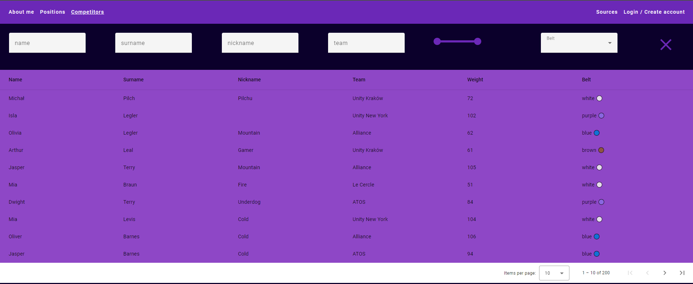

# Angular BJJ App - BjjBible - WORK IN PROGRESS ⏳⏳⏳

## Description
The Angular BJJ app is a small project designed to showcase my Angular skills and introduce you to the world of Brazilian Jiu-Jitsu (BJJ). As an aspiring front end developer and a dedicated BJJ practitioner, I've merged these two aspects of life into one app.

## Sections

- **About Me**: Basic information about me
- **Positions**: Introduction to 6 basic positions in the sport of Brazilian Jiu-Jitsu.
- **Own Techniques**: Available for logged-in users. You can create your own sequences of moves in form of stepper/list to help you remember the order, purpose and details of every move.
- **Competitors**: Table which contains random generated data which you can filter accordingly to your needs.
- **Sources**: Links to the sites I used to make this app. 
- **Account Settings**: Your account settings where you can personalise your experience

## Contact

- Email: mchpilch@gmail.com
- GitHub: [github.com/mchpilch](https://github.com/mchpilch)

Keep on rolling!

